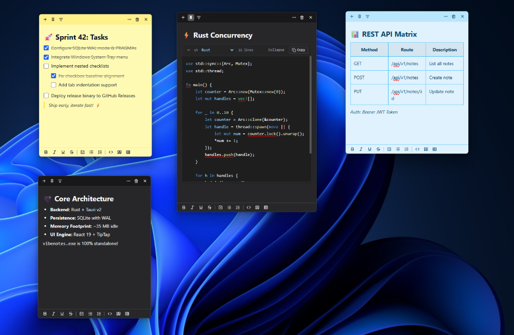
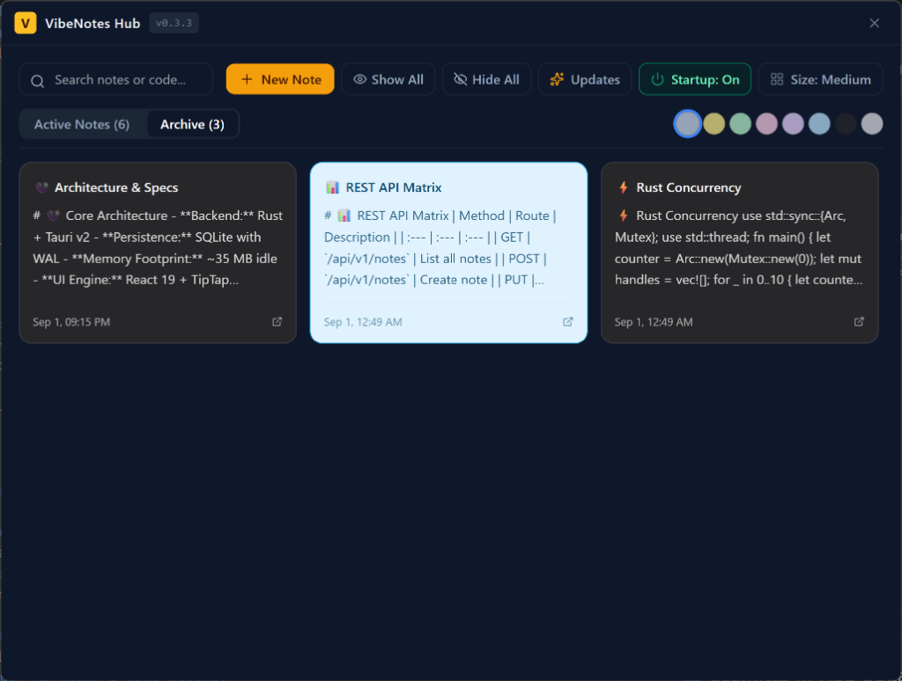

# VibeNotes 📝⚡

A lightweight, developer-focused Windows desktop application inspired by **Windows Sticky Notes**, with native Markdown editing, syntax-highlighted collapsible code blocks, SQLite persistence, and native Windows Startup / System Tray integration.

Built with **Tauri v2 + Rust + React 19 + TypeScript + Tailwind CSS** (Under 40 MB idle RAM, zero Chromium bloat).

---

## 📸 Screenshots

### 🪟 Floating Desktop Sticky Notes
Multi-theme floating notes with interactive checklists, VS Code Dark+ code blocks, and markdown tables:



---

### 🗄️ Central Notes Hub
Search notes, filter by color, toggle card sizes, and manage your entire workspace:



---

## ✨ Features

- 🪟 **Floating Frameless Sticky Notes:** Custom drag regions, real-time coordinate & size persistence, and per-note "Always on Top" pin.
- 🚀 **Windows Startup & System Tray:** Run in background with a native tray context menu (*New Note, Notes Hub, Show/Hide All, Startup Toggle, Exit*).
- 🎨 **7 Color Themes:** Classic Yellow, Mint Green, Pastel Pink, Lavender Purple, Sky Blue, Charcoal Dark, and Slate Grey.
- 💻 **Developer Markdown & Code Blocks:**
  - Multi-language syntax highlighting with VS Code Dark+ styling.
  - Collapsible / Expandable long code snippets with line count badges.
  - One-click "Copy Code" button.
  - Interactive checklists with nested task lists (`Tab` / `Shift+Tab`).
  - Tables, blockquotes, links, and drag-and-drop image support.
- 🗄️ **Central Notes Hub:** Search, filter by color, archive, or permanently delete notes, with a toggleable card size view (*Small, Medium, Large*).
- 🔒 **Single Instance Protection:** Native Windows Kernel Mutex ensures only one instance runs at a time.
- 🤖 **Model Context Protocol (MCP) Server:** Manage your sticky notes with any AI agent (Antigravity, Claude Desktop, Cursor, Claude Code, Cline) with full support for tables, code blocks, checklists, and themes!
- 💾 **SQLite Storage:** Crash-resilient local database with Write-Ahead Logging (WAL) stored in `%APPDATA%/VibeNotes/vibenotes.db`.

---

## 🤖 Model Context Protocol (MCP) Server

VibeNotes features a **built-in, native Rust Model Context Protocol (MCP) server** embedded directly inside the `vibenotes.exe` binary. 

This enables any AI coding assistant or autonomous agent (**Google Antigravity**, **Claude Desktop**, **Cursor**, **Claude Code**, **Cline**, **Windsurf**, etc.) to create and manage your desktop sticky notes in real time over standard I/O (stdio) with **zero runtime dependencies** (no Node.js or npm needed!).

```
┌─────────────────────────────────────────────────────────────┐
│                       vibenotes.exe                         │
├──────────────────────────────┬──────────────────────────────┤
│    Standard App Launch       │       `--mcp` Flag           │
│   (Double-click or Startup)  │   (Launched by AI Agent)     │
├──────────────────────────────┼──────────────────────────────┤
│  • Floating Sticky Notes GUI │  • Embedded Rust MCP Server  │
│  • System Tray Menu          │  • Stdio JSON-RPC 2.0 Loop   │
│  • Central Notes Hub         │  • Zero Node.js Required     │
└──────────────┬───────────────┴──────────────┬───────────────┘
               │                              │
               └──────────────┬───────────────┘
                              ▼
                %APPDATA%/VibeNotes/vibenotes.db
                  (SQLite Concurrent WAL Mode)
```

---

### ⚙️ Client Configurations (Ready to Paste)

#### 1. Claude Desktop
Add to `%APPDATA%\Claude\claude_desktop_config.json`:

```json
{
  "mcpServers": {
    "vibenotes": {
      "command": "C:/Program Files/VibeNotes/vibenotes.exe",
      "args": ["--mcp"]
    }
  }
}
```
*(In development, point to `d:/Dev/VibeCoding/VibeNotes/src-tauri/target/release/vibenotes.exe`)*

#### 2. Google Antigravity & Cursor
Add to your project or user `.gemini/antigravity/mcp.json` or `.cursor/mcp.json`:

```json
{
  "mcpServers": {
    "vibenotes": {
      "command": "C:/Program Files/VibeNotes/vibenotes.exe",
      "args": ["--mcp"]
    }
  }
}
```

#### 3. Claude Code CLI
```bash
claude mcp add vibenotes -- "C:/Program Files/VibeNotes/vibenotes.exe" --mcp
```

#### 4. Cline / Roo Code / Windsurf
Add to your MCP Settings:

```json
{
  "mcpServers": {
    "vibenotes": {
      "command": "C:/Program Files/VibeNotes/vibenotes.exe",
      "args": ["--mcp"],
      "disabled": false,
      "autoApprove": []
    }
  }
}
```

> 💡 **Tip:** If you are developing locally without installing, replace `"C:/Program Files/VibeNotes/vibenotes.exe"` with your local build path: `"d:/Dev/VibeCoding/VibeNotes/src-tauri/target/release/vibenotes.exe"`.

---

### 🛠️ Available MCP Tools & Commands

| Tool | Description | Parameters |
| :--- | :--- | :--- |
| **`create_note`** | Creates a new floating sticky note with rich markdown. | `content` (Markdown string with tables, code blocks, checklists), `title` (optional), `color_theme` (`yellow`, `green`, `pink`, `purple`, `blue`, `charcoal`, `grey`), `is_pinned` (bool), `is_always_on_top` (bool) |
| **`update_note`** | Updates markdown content, title, theme, pin, or always-on-top status. | `id` (required), `content`, `title`, `color_theme`, `is_pinned`, `is_always_on_top` |
| **`append_note_content`** | Appends markdown text, code blocks, tables, or task items to an existing note. | `id` (required), `content` (required) |
| **`manage_checklist`** | Checks, unchecks, toggles, or adds tasks directly without rewriting the note. | `id` (required), `action` (`list`, `check`, `uncheck`, `toggle`, `add_item`), `item_index` (0-based int), `item_text` (match query), `new_item_text` |
| **`list_notes`** | Lists active or archived notes with search, color filtering, and live task completion stats. | `search` (query string), `color_theme`, `include_archived` (bool) |
| **`get_note`** | Retrieves complete note details, raw markdown, and checklist breakdown. | `id` (required) |
| **`delete_note`** | Removes a sticky note (archives by default, or permanently deletes). | `id` (required), `permanent` (bool, default: `false`) |
| **`restore_note`** | Restores an archived sticky note back to the active desktop workspace. | `id` (required) |

---

### 💡 Example AI Agent Prompts to Try

- 📝 *"Create a blue sticky note titled 'Sprint 42 Deliverables' with a checklist for today's tasks."*
- ☑️ *"Mark the task 'Deploy migration' as done in my Sprint note."*
- 💻 *"Create a charcoal sticky note with this Rust concurrency snippet."*
- 📊 *"Add a markdown table comparing SQLite vs PostgreSQL to my Architecture note."*
- 🔍 *"List all my active sticky notes and show which ones have pending tasks."*
- 🗄️ *"Archive my meeting notes from yesterday."*


---

## 🚀 Quick Start Guide

### 1. Prerequisites

Make sure you have the following installed on Windows:

1. **[Node.js](https://nodejs.org/)** (v18 or higher)
2. **[Rust & Cargo](https://www.rust-lang.org/tools/install)** (`rustup` with the `x86_64-pc-windows-msvc` toolchain)
3. **[C++ Build Tools](https://visualstudio.microsoft.com/visual-cpp-build-tools/)** (from Visual Studio Installer)
4. **Microsoft Edge WebView2** (pre-installed by default on Windows 10/11)

---

### 2. Clone & Install Dependencies

```bash
# Clone repository
git clone https://github.com/vahabahmadvand/VibeNotes.git
cd VibeNotes

# Install frontend dependencies
npm install
```

---

### 3. Run in Development Mode

Starts the live development server with hot-reloading:

```bash
npm run tauri dev
```

---

### 4. Build Standalone Executable (.exe) & Installer

To compile an optimized, standalone Windows executable:

```bash
npm run tauri build
```

Once the build finishes:
- **Standalone `.exe`**: `src-tauri/target/release/vibenotes.exe` (~12 MB)
- **NSIS Setup Installer**: `src-tauri/target/release/bundle/nsis/VibeNotes_0.2.0_x64-setup.exe`
- **MSI Installer**: `src-tauri/target/release/bundle/msi/VibeNotes_0.2.0_x64_en-US.msi`

You can take `vibenotes.exe` and run it anywhere on Windows without installing anything!

---

## 🛠️ Project Structure

```
VibeNotes/
├── docs/                      # Screenshots & assets for README
│   └── screenshots/
│       ├── sticky-notes-preview.png
│       └── notes-hub-preview.png
├── src/                       # React 19 Frontend
│   ├── components/
│   │   ├── StickyNote.tsx     # Floating frameless sticky note window
│   │   ├── NotesHub.tsx       # Central searchable notes manager
│   │   ├── CodeBlockView.tsx  # Syntax-highlighted code block with collapse/expand
│   │   ├── FormatToolbar.tsx  # WYSIWYG markdown formatting bar
│   │   ├── ThemePicker.tsx    # 7-color palette switcher
│   │   └── DeleteConfirmModal.tsx # Delete confirmation dialog
│   ├── styles/
│   │   └── globals.css        # Themes & custom CSS tokens
│   ├── App.tsx                # Route switcher (#/note/:id vs #/hub)
│   ├── main.tsx               # Frontend entrypoint
│   └── types.ts               # Shared TypeScript models
├── src-tauri/                 # Rust Backend (Tauri v2)
│   ├── src/
│   │   ├── main.rs            # Application entrypoint & Windows subsystem
│   │   ├── lib.rs             # App setup, tray setup, and window restoration
│   │   ├── autostart.rs       # Windows Registry HKCU Run key manager
│   │   ├── tray.rs            # Native System Tray menu & event dispatcher
│   │   ├── db.rs              # SQLite connection pool, WAL mode, migrations
│   │   ├── commands.rs        # Tauri IPC commands & multi-window manager
│   │   └── models.rs          # Data structures
│   ├── Cargo.toml             # Rust dependencies (rusqlite, winreg, tauri v2)
│   └── tauri.conf.json        # Tauri configuration & capabilities
├── package.json
└── tailwind.config.js
```

---

## 📄 License

MIT License. Free for personal and commercial use.
